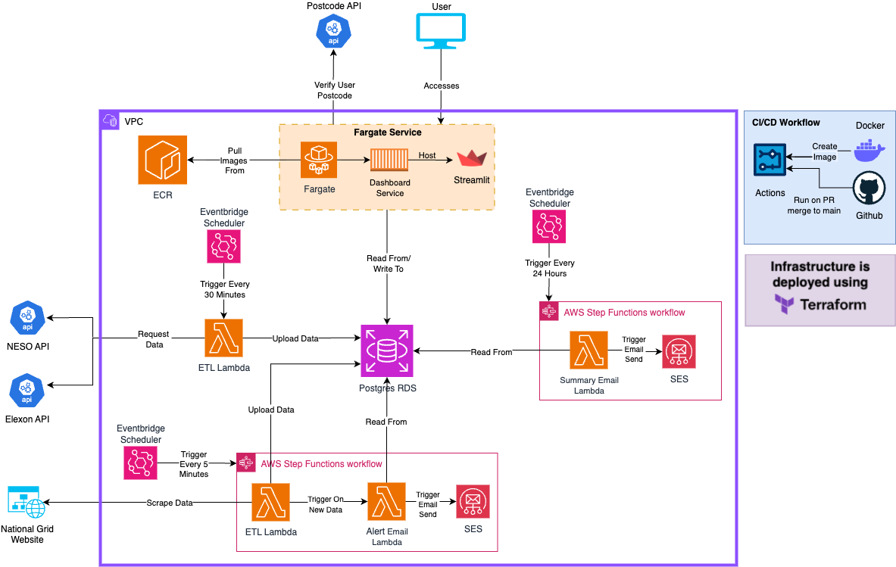
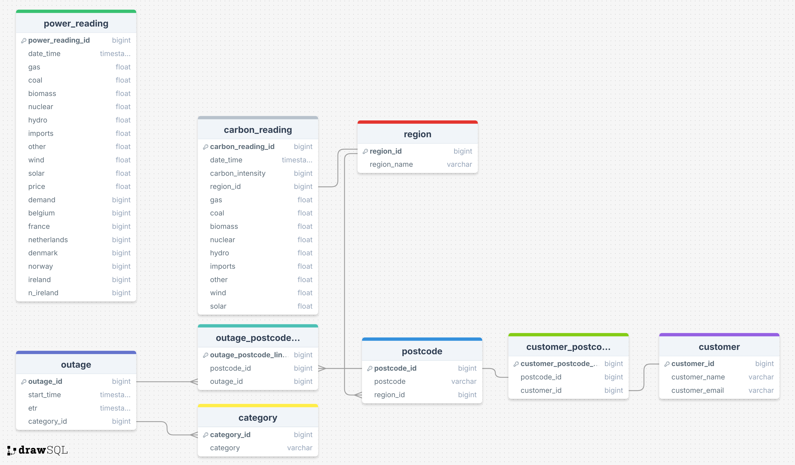

# Energy Monitor     

## Description of the project

This project aims to collate data from various sources and present it in an accessible and easily understandable format. 


## usage

The project provides value in three main ways: 

- Power outage email alerts which provide live updates on current power outages.
- Email reports which provide regular summaries on power generation, pricing, demand and carbon intensity .
- An interactive dashboard which provide visualisations on power generation, pricing, power outages and carbon intensity. Also allowing users to sign up for either of the emailing services.

## Environment set up

### Database connection 

```
DB_NAME={your db name}
DB_USERNAME={your db username}
DB_PASSWORD={your db password}
DB_PORT={your db port}
DB_HOST={your db host}
```

### Terraform

```
ACCESS_KEY={your aws access key}
SECRET_KEY={your aws secret access key}
VPC_ID={your vpc id}
VPC_PUBLIC_SUBNET_1={your vpc public subnet 1}
VPC_PUBLIC_SUBNET_2={your vpc public subnet 2}
VPC_PUBLIC_SUBNET_3={your vpc public subnet 3}
REGION={your aws region }
DB_HOST={your db host}
DB_NAME={your db name}
DB_USERNAME={your db username}
DB_PASSWORD={your db password}
DB_PORT={your db port}
```

## How to run the project

### Run locally 

1. Add the environment setup details to a local postgres database in your .env file.
2. Run the files schema.sql then seed.sql on your local database.
3. Run the handler function from load_outages.py in the outages subdirectory and load_main.py in the power_readings subdirectory
4. Run the dashboard.py file using streamlit to view the visualisations and sign up.
5. Run the handler function from summary_report_html.py to view the theoretical email and recipients for the summary emails
6. Run the handler function from {} to view the theoretical power outage alerts and the recipients.
7. Repeat step 3 to add more entries to the database.

### Run on the cloud

1. Add setup details to .env file and terraform.tfvars file. 
2. Run terraform apply on the terraform stage 1 file.
3. Run the files schema.sql then seed.sql on your RDS database.
4. Using the subsequent dockerfiles, build and push the images to the ecr for the following: dashboard, power outages ETL, power readings ETL, summary email generation script and alert generation script.
5. Run terraform apply on the terraform stage 2 file.
6. Run the dashboard from the ecs tasks public ip address using port 8501 e.g ```{public ip address}:8501```.

## Architecture


## ERD
